# Anima

Anima is a standalone terminal animation toolkit from Yazelix. It works in any
capable terminal; no Yazelix installation is required.

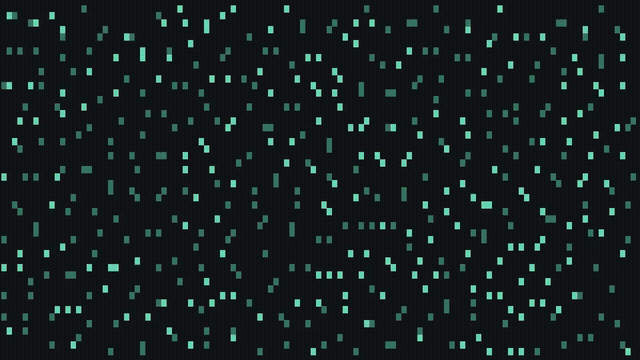

[See every animation](#animation-gallery).

The user-facing command is `anima`. The named Nix package/app is `anima`;
the default Nix entry points select the same executable.

```bash
nix run github:Yazelix/anima#anima
nix run github:Yazelix/anima#anima -- static
nix run github:Yazelix/anima#anima -- asciiquarium --duration-seconds 3
nix run github:Yazelix/anima#anima -- mandelbrot
nix run github:Yazelix/anima#anima -- friends_and_enemies
nix run github:Yazelix/anima#anima -- primordial
nix run github:Yazelix/anima#anima -- physarum
nix run github:Yazelix/anima#anima -- chladni
nix run github:Yazelix/anima#anima -- plasma
nix run github:Yazelix/anima#anima -- game_of_life_tumblers --cell-style dotted
nix run github:Yazelix/anima#anima -- random --duration-seconds 3
```

## What It Contains

- Animation engines for Boids, friends and enemies, Primordial Particle Systems, Physarum trail networks, Chladni nodal patterns, Plasma interference, Mandelbrot, Matrix rain, and Game of Life
- The separately packaged `asciiquarium-rs` terminal aquarium
- Static and logo-style Yazelix welcome screens
- File-backed Kitty PNG frame sequence rendering
- Frame production through `ScreenFrameProducer`
- Terminal sizing helpers and alternate-screen rendering helpers
- A standalone `anima` binary with interactive and timed playback
- Small examples for library consumers

## Special Thanks

Special thanks to:

- [Craig Reynolds](https://www.red3d.com/cwr/), who created
  [Boids](https://www.red3d.com/cwr/boids/) in 1986. Anima implements its
  separation, alignment, and cohesion rules in its flocking animations.
- [John Horton Conway](https://mathshistory.st-andrews.ac.uk/Biographies/Conway/),
  who invented the Game of Life in 1970. Anima runs his cellular automaton
  with glider and tumbler seeds.
- [Simon Woods](https://community.wolfram.com/groups/-/m/t/122095), who
  published the friends-and-enemies particle dance. Anima implements its
  update rule in its dense particle animation.
- [Benoît Mandelbrot](https://news.yale.edu/2010/10/18/memoriam-benoit-mandelbrot),
  whose pioneering fractal work led to the Mandelbrot set. It inspires Anima's
  Mandelbrot animation.
- [Simon Whiteley](https://www.wired.com/story/the-matrix-code-sushi-recipe/),
  who designed the digital rain for *The Matrix*. It inspires Anima's Matrix
  animation.
- [Thomas Schmickl, Martin Stefanec, and Karl Crailsheim](https://www.nature.com/articles/srep37969),
  who introduced the Primordial Particle System motion law. Anima implements
  that law in its Primordial animation.
- [Jeff Jones](https://doi.org/10.1162/artl.2010.16.2.16202), whose particle model
  of Physarum transport networks inspires Anima's trail-network animation.
- [Paul Bourke](https://www.paulbourke.net/geometry/chladni/), who documents the
  Chladni nodal equations used in Anima's geometric animation.
- [Lode Vandevenne](https://lodev.org/cgtutor/plasma.html), who documents
  sine-sum plasma and circular palettes. Anima uses that technique with its
  own wave frequencies, motion, and colors.

## User Command

Installed standalone command:

```bash
anima --help
anima
anima static
anima asciiquarium --duration-seconds 3
anima friends_and_enemies --duration-seconds 3
anima primordial --duration-seconds 3
anima physarum --duration-seconds 3
anima chladni --duration-seconds 3
anima plasma --duration-seconds 3
anima mandelbrot
anima game_of_life_tumblers --cell-style dotted
anima random --duration-seconds 3
```

Nova users get the integrated animation surface through the main command:

```bash
yzx anima
yzx anima chladni
```

## Repository Usage

From this repository:

```bash
cargo run --bin anima -- --help
cargo run --bin anima -- static
cargo run --bin anima -- asciiquarium --duration-seconds 3
cargo run --bin anima -- friends_and_enemies --duration-seconds 3
cargo run --bin anima -- primordial --duration-seconds 3
cargo run --bin anima -- physarum --duration-seconds 3
cargo run --bin anima -- chladni --duration-seconds 3
cargo run --bin anima -- plasma --duration-seconds 3
cargo run --bin anima -- mandelbrot
cargo run --bin anima -- game_of_life_tumblers --cell-style dotted
cargo run --bin anima -- random --duration-seconds 3
```

Source-only Cargo runs resolve `asciiquarium-rs` from `PATH`; Nix runs use the
pinned upstream executable

With Nix:

```bash
nix build .#anima
nix run .#anima -- --help
nix run .#anima -- static
nix run .#anima -- asciiquarium --duration-seconds 3
nix run .#anima -- friends_and_enemies --duration-seconds 3
nix run .#anima -- primordial --duration-seconds 3
nix run .#anima -- physarum --duration-seconds 3
nix run .#anima -- chladni --duration-seconds 3
nix run .#anima -- plasma --duration-seconds 3
nix run .#anima -- mandelbrot
nix run .#anima -- random --duration-seconds 3
```

The [gallery](#animation-gallery) shows every distinct animation. `boids` is an
alias of `boids_predator`. `static` shows a still welcome card; `random` chooses
an animation. No style means `random`

In animations, including Aquarium, `Left`/`h`/`p` selects the previous style and
`Right`/`l`/`n` selects the next; any other key exits. Aquarium precedes Boids:
Predator in the wrapping cycle. Switching preserves the original session timer

A top-left card in native animations shows the name, the original creator's role and
credit, and `←/h previous · l/→ next` on startup and after switching styles.
Its text and border fade in for one second, hold for two, then fade out for
one. Short timed sessions scale that sequence to the remaining time;
switching does not extend the session. The RGB fade uses an opaque black
backing inside the border for contrast; border cells use the terminal's normal
background so the fill does not extend outside the rounded outline.
Credits wrap in narrow terminals; the card stays hidden
if the complete text cannot fit. Static, logo, and the separate aquarium
process do not use this card. Library frame producers return animation-only
frames

Random chooses from all current native animations and Aquarium, including
`friends_and_enemies`, `physarum`, `chladni`, and `plasma`. `static` and `logo`
remain explicitly selectable but outside that pool. The library random helper
includes all native animation families with equal family weighting; it does
not launch the external Aquarium process

In `physarum`, agents follow and deposit trails that diffuse into branching
networks. The animation uses truecolor half blocks, a 6,000-agent ceiling, and
the shared duration, input, and resize handling. It adds no dependency. This is
a visual approximation of Jones's model, without biological-fidelity claims

In `chladni`, five standing-wave mode pairs blend through a 900-frame loop
(36 seconds of frame delays, plus rendering and terminal I/O time).
Warm nodal lines separate blue and violet regions on an opaque background.
The animation uses square half-block samples under the 2:1 terminal-cell
convention, cached cosine terms, and a fixed palette of at most 64 colors.
It is a visual approximation of plate patterns, not an acoustic simulation

In `plasma`, horizontal, vertical, diagonal, and radial sine waves form moving
color bands. A circular 64-color palette shifts through the field without a
hard color seam. The animation uses square half-block samples under the 2:1
terminal-cell convention and a 1,200-frame loop (48 seconds of frame delays,
plus rendering and terminal I/O time). Spatial phases are cached on resize;
frame updates use a fixed amount of work per pixel and add no dependency

The aquarium runs as a separate
[`Yazelix/asciiquarium-rs`](https://github.com/Yazelix/asciiquarium-rs) process under
its GPL-2.0-or-later license. Its upstream [credit and
lineage](https://github.com/cablehead/asciiquarium-rs#credit-and-lineage) section
traces it to Kirk Baucom's original Perl program, Joan Stark's ASCII art,
Claudio Matsuoka's additions, and `cablehead`'s Rust port. The fork adds a
[hosted navigation contract](https://github.com/Yazelix/asciiquarium-rs#yazelix-fork)
without changing the art or linking Aquarium into Anima. Anima owns one terminal
session and deadline; Aquarium owns input and drawing while active. Anima reaps
the child on navigation, exit, terminal loss, or deadline expiry. On Unix, the
CLI handles termination signals through the existing `signal-hook` dependency
so its guards can restore the terminal. Standalone Aquarium controls remain
unchanged. Cargo-only Anima installs require this fork's executable on `PATH`;
Nix packages pin it without relying on `PATH`

## Animation Gallery

Each preview is a short looping excerpt, not a complete simulation cycle.
Run the command above a GIF to watch that style in your terminal.

### Logo

`anima logo`

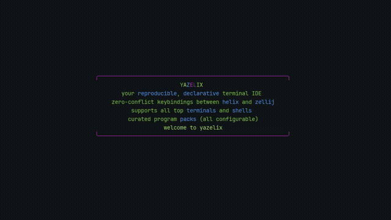

### Aquarium

`anima asciiquarium`

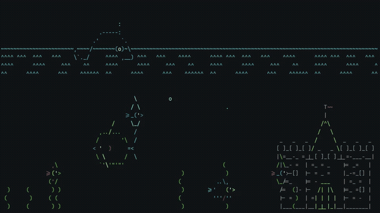

### Boids: Predator

`anima boids_predator` (alias: `anima boids`)

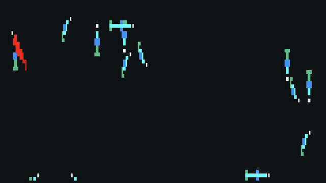

### Boids: Schools

`anima boids_schools`

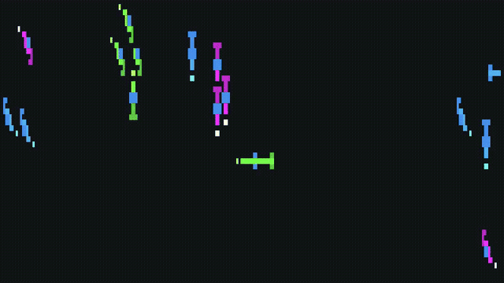

### Friends and Enemies

`anima friends_and_enemies`

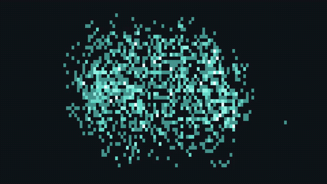

### Primordial

`anima primordial`

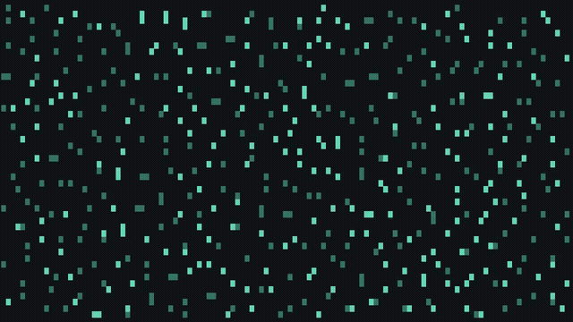

### Physarum

`anima physarum`

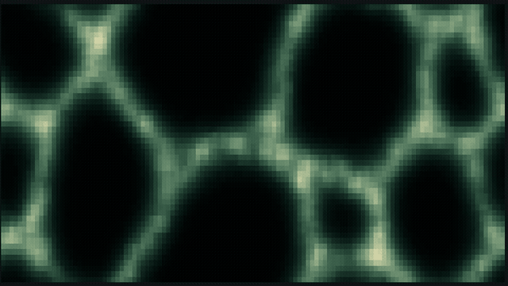

### Chladni

`anima chladni`

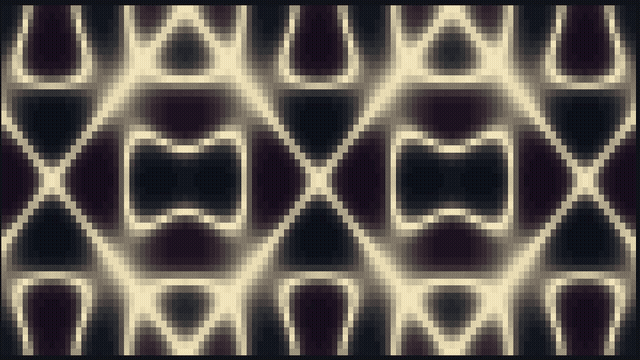

### Plasma

`anima plasma`

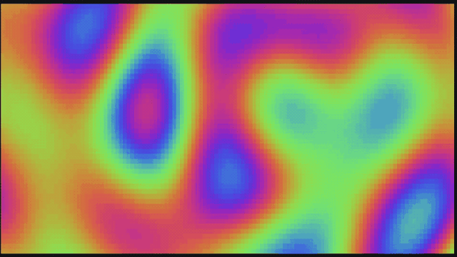

### Mandelbrot

`anima mandelbrot`

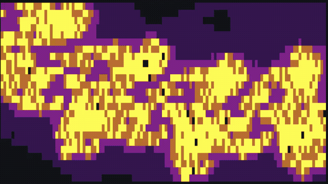

### Matrix

`anima matrix`

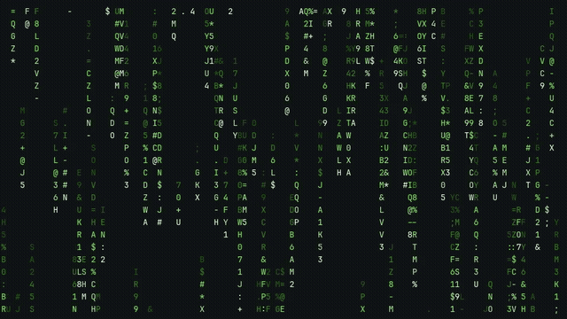

### Game of Life: Gliders

`anima game_of_life_gliders`

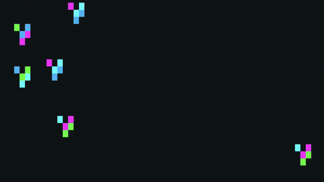

### Game of Life: Tumblers

`anima game_of_life_tumblers`

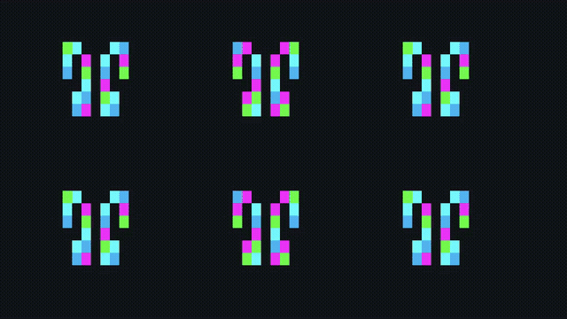

## Library Examples

Render one frame without alternate-screen mode:

```bash
cargo run --example render_once
```

Play a style for a bounded number of frames:

```bash
cargo run --example play_style -- mandelbrot 90
cargo run --example play_style -- matrix 90
cargo run --example play_style -- boids_schools 120
cargo run --example play_style -- friends_and_enemies 90
cargo run --example play_style -- primordial 180
cargo run --example play_style -- physarum 180
cargo run --example play_style -- chladni 180
cargo run --example play_style -- plasma 180
cargo run --example play_style -- game_of_life_gliders 80
```

The second argument is the frame count. The examples use only `yazelix_screen` APIs and standard Rust APIs

## Boundary With Yazelix

`yazelix_screen` owns reusable animation and terminal-rendering primitives, including standalone Yazelix-branded screen styles. Integrated welcome/session policy stays outside the crate

The crate must not depend on:

- `yazelix_core`
- `settings.jsonc`
- generated Yazelix config or state
- Zellij session state
- Home Manager install state
- Yazelix command palette or workspace orchestration

Nova consumes this crate for integrated rendering. `yzx anima` is the integrated Nova command; `anima` is the standalone command for terminal users who want only the screen animations

## Surfaces

- Product/repository: `anima`
- Command: `anima`
- Rust crate: `yazelix_screen`
- Integrated Nova command: `yzx anima`

## Release Policy

External releases use SemVer. Breaking changes to frame producer traits, style names, terminal-mode helpers, or cell-style parsing require a major version bump

Component tags should use:

```text
v0.2.0
```

## Verification

The gallery and hero montage are recorded from the local `anima` package through
[Kinestra](https://github.com/Yazelix/kinestra) and a pinned Mars terminal:

```sh
nix run .#record-demo
```

Run this from the repository root on x86_64 Linux. The recipe exports a
two-second excerpt per style after a four-second warm-up (15 seconds for
Physarum). Each `assets/animations/STYLE.gif` is 640 × 360 at 10 FPS with a
64-color palette. Capture headroom keeps shutdown frames out of the excerpts.
Live recordings vary between takes.
The eight-second hero montage reuses two seconds each of Primordial, Mandelbrot,
Matrix, and tumblers. [A still preview](assets/anima-poster.png) is also available.

The Rust recipe is [demo/record.rs](demo/record.rs); appearance settings live in
`demo/mars/`. It checks its inventory against packaged CLI help and prints each
GIF's byte size and the gallery total. When adding an animation, update the
recipe and gallery together, inspect the motion and framing, and review asset
sizes before committing. `boids` shares the predator GIF; `static` and `random`
do not need separate previews.

Nix compiles the recipe against the pinned Kinestra library. Intermediate MP4s
stay in ignored `demo/.work/`. Recording tools and gallery assets stay outside
the installed `anima` closure. Kinestra and Mars revisions are pinned in `flake.lock`.

From this repository:

```bash
cargo fmt --all -- --check
cargo check --examples
cargo test
cargo run --bin anima -- --help
cargo run --example render_once
nix build .#anima
nix run .#anima -- --help
```
